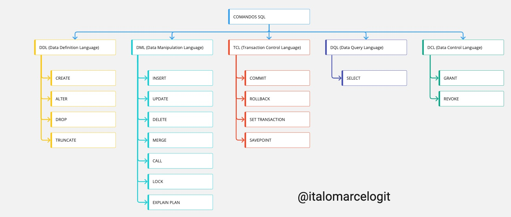

# Comandos SQL - MySQL

## Data Definition Language (DDL)
DDL consiste em comandos SQL que podem ser usados ​​para definir o esquema do banco de dados. DDL trata da descrição do banco de dados, atualização e exclusão do banco de dados.

## Data Manipulation Language (DML)
DML é usado para manipular os dados existentes no banco de dados.

## Transaction Control Language (DCL)
TCL é usado para lidar com as operações de transação no banco de dados

## Data Query Language (DQL)
DQL é utilizado para fazer consultas em uma ou mais tabelas de um banco de dados. 

## Data Control Language
DCL controla o acesso aos dados armazenados no banco de dados.
